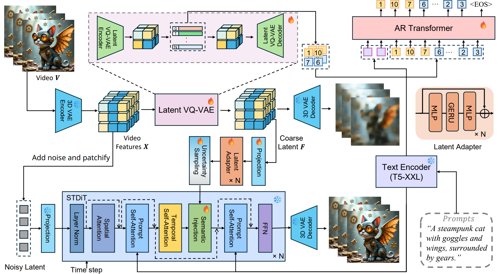

### 
 ARLON: Boosting Diffusion Transformers With Autoregressive Models for Long Video Generation 
 

   &ensp;

<!--  -->

# **ARLON**

Text-to-video (T2V) models have recently undergone rapid and substantial advancements. Nevertheless, due to limitations in data and computational resources, achieving efficient generation of long videos with rich motion dynamics remains a significant challenge. To generate high-quality, dynamic, and temporally consistent long videos, this paper presents ARLON, a novel framework that boosts diffusion Transformers with autoregressive (**AR**) models for long (**LON**) video generation, by integrating the coarse spatial and long-range temporal information provided by the AR model to guide the DiT model effectively. Specifically, ARLON incorporates several key innovations: 1) A latent Vector Quantized Variational Autoencoder (VQ-VAE) compresses the input latent space of the DiT model into compact and highly quantized visual tokens, bridging the AR and DiT models and balancing the learning complexity and information density; 2) An adaptive norm-based semantic injection module integrates the coarse discrete visual units from the AR model into the DiT model, ensuring effective guidance during video generation; 3) To enhance the tolerance capability of noise introduced from the AR inference, the DiT model is trained with coarser visual latent tokens incorporated with an uncertainty sampling module. Experimental results demonstrate that ARLON significantly outperforms the baseline OpenSora-V1.2 on eight out of eleven metrics selected from VBench, with notable improvements in dynamic degree and aesthetic quality, while delivering competitive results on the remaining three and simultaneously accelerating the generation process. In addition, ARLON achieves state-of-the-art performance in long video generation, outperforming other open-source models in this domain. Detailed analyses of the improvements in inference efficiency are presented, alongside a practical application that demonstrates the generation of long videos using progressive text prompts.

Demos can refer to [ARLON](https://arlon-t2v.github.io).